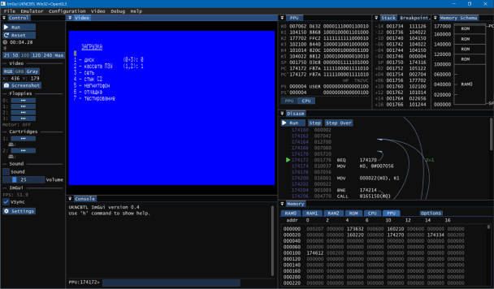

# ukncbtl-imgui
UKNCBTL — UKNC Back to Life! emulator, Win32 / ImGui version.

### На русском / In Russian
UKNCBTL — UKNC Back to Life! — это эмулятор компьютера Электроника МС-0511 (УКНЦ).
УКНЦ это советский домашний/учебный компьютер, построенный на двух процессорах КМ1801ВМ2, совместимых по системе команд с Электроника-60, ДВК и др.

Этот репозиторий содержит версию эмулятора с интерфейсом на **ImGui**.

Текущее состояние эмулятора: **пока только Win32 версия, в разработке**.

#### Лицензии
* Код эмулятора: GNU LGPL v3
* ImGui: MIT
* Font Awesome 5 Free: SIL OFL 1.1 License on fonts, CC BY 4.0 License on icons, see https://fontawesome.com/license/free

#### Благодарности

Огромное спасибо всем тем, кто внёс свой вклад в создание и развитие эмулятора, особенно:
 * Феликс Лазарев — проделал огромную работу на начальном этапе развития эмулятора
 * Алексей Кислый (Alex_K) — оказал неоценимую помощь во всех вопросах, касающихся деталей работы УКНЦ

### In English
*UKNCBTL* is cross-platform UKNC emulator for Windows/Linux/Mac OS X.
*UKNC* (*УКНЦ*, Электроника МС-0511) is soviet school computer based on two PDP-11 compatible processors KM1801VM2.

This repository is for **ImGui** version of the emulator.

Current status: **Win32 version only for now, under development**.

-----
The UKNCBTL project consists of:
* [ukncbtl](https://github.com/nzeemin/ukncbtl/) written for Win32 and works under Windows 2000/2003/2008/XP/Vista/7/8/10.
* [ukncbtl-renders](https://github.com/nzeemin/ukncbtl-renders/) — renderers for UKNCBTL Win32.
* [ukncbtl-qt](https://github.com/nzeemin/ukncbtl-qt/) is based on Qt framework and works under Windows, Linux and Mac OS X.
* [ukncbtl-testbench](https://github.com/nzeemin/ukncbtl-testbench/) — test bench for regression and performance testing.
* [ukncbtl-utils](https://github.com/nzeemin/ukncbtl-utils/) — various utilities: rt11dsk, sav2wav, ESCParser etc.
* [ukncbtl-doc](https://github.com/nzeemin/ukncbtl-doc/) — documentation and screenshots.
* [ukncbtl-wasm](https://github.com/nzeemin/ukncbtl-wasm/) — web version of the emulator.
* [ukncbtl-imgui](https://github.com/nzeemin/ukncbtl-imgui) — ImGui versioin of the emulator.
* Project wiki: https://github.com/nzeemin/ukncbtl-doc/wiki
  * Screenshots: https://github.com/nzeemin/ukncbtl-doc/wiki/Screenshots-ru
  * User's Manual (in Russian): https://github.com/nzeemin/ukncbtl-doc/wiki/Users-Manual-ru
